# Gemini Image Prompt: Data Transformation Journey Diagram

Use this prompt in Google Gemini (gemini.google.com) or Imagen to generate a professional data flow diagram.

---

## Prompt 1: Main Architecture Diagram

```
Create a professional, modern data pipeline architecture diagram for a presentation slide. The diagram should show a horizontal flow from left to right with 4 distinct stages, using a clean corporate style with the Databricks color palette (orange #FF3621, dark blue #1B3139, light gray #F5F5F5).

**Stage 1 - SOURCE (leftmost)**
- Icon: Cloud with "JSON" label
- Color: Gray (#6B7280)
- Label below: "Raw Transcripts"
- Sub-labels: "Balto • Genesys • Five9"
- Show multiple JSON file icons feeding into the pipeline

**Stage 2 - BRONZE**
- Icon: Database cylinder
- Color: Bronze/copper (#CD7F32)
- Label: "BRONZE"
- Sub-label: "Parse & Structure"
- Inside the stage, show 4 small table icons labeled: "calls", "utterances", "agents", "members"
- Transformation badge: "Flatten JSON → Delta Tables"

**Stage 3 - SILVER**
- Icon: Database cylinder with sparkle/AI symbol
- Color: Silver (#C0C0C0) with blue AI glow
- Label: "SILVER"
- Sub-label: "AI Enrichment"
- Show 4 AI function badges floating above:
  • "ai_sentiment()"
  • "ai_classify()"
  • "ai_summarize()"
  • "ai_extract()"
- Transformation badge: "Foundation Model Processing"

**Stage 4 - GOLD (rightmost)**
- Icon: Database cylinder with chart/analytics symbol
- Color: Gold (#FFD700)
- Label: "GOLD"
- Sub-label: "Analytics Ready"
- Show output tables: "call_summary", "agent_KPIs", "compliance_analysis"
- Transformation badge: "Aggregate & Denormalize"

**Connecting Elements:**
- Large directional arrows between each stage
- Arrow labels: "Ingest" → "Enrich" → "Aggregate"
- At the end, show 3 output icons representing: Genie Space, Knowledge Assistant, Supervisor Agent

**Style Requirements:**
- Clean, flat design (no 3D effects)
- White or very light gray background
- Professional corporate aesthetic suitable for executive presentation
- Clear hierarchy and visual flow
- Rounded rectangles for containers
- Consistent iconography
- No cluttered elements
- 16:9 aspect ratio for presentation slide
```

---

## Prompt 2: Simplified Version (If First Is Too Complex)

```
Create a clean, minimalist data pipeline diagram showing 4 horizontal stages:

1. SOURCE (gray) - JSON files icon with "Raw Transcripts" label
2. BRONZE (copper color) - Database icon with "Parse JSON" label
3. SILVER (silver with blue glow) - Database with AI sparkle, label "AI Functions: sentiment, classify, summarize"
4. GOLD (gold color) - Database with chart icon, label "Analytics Tables"

Connect stages with large arrows. Use flat design, corporate blue and orange accents, white background. 16:9 ratio. Professional presentation quality.
```

---

## Prompt 3: Detailed Transformation Focus

```
Create an infographic-style diagram showing data transformations in a medallion architecture pipeline.

Layout: Vertical flow with 4 horizontal bands

**Band 1 - INPUT**
- Show: JSON document icon
- Fields listed: call_id, utterances[], agent_id, timestamps
- Color: Gray

**Band 2 - BRONZE TRANSFORMATIONS**
- Show: Arrow pointing down with transformation icons
- Transformations: "Parse JSON" → "Flatten Arrays" → "Add Metadata"
- Output tables: 4 cylinder icons (bronze colored)
- Color: Copper/Bronze

**Band 3 - SILVER TRANSFORMATIONS (highlight this band)**
- Show: Large AI brain icon or sparkle
- 4 transformation boxes:
  • "ai_analyze_sentiment(text)" → "sentiment score"
  • "ai_classify(transcript, categories)" → "call_reason"
  • "ai_classify(transcript, compliance)" → "compliance_status"
  • "ai_summarize(transcript)" → "2-sentence summary"
- Output: 3 enriched table icons (silver with blue tint)
- Color: Silver with blue AI glow effect

**Band 4 - GOLD TRANSFORMATIONS**
- Show: Aggregation symbols (Σ, AVG, JOIN)
- Transformations: "Denormalize" → "Calculate KPIs" → "Aggregate Metrics"
- Output: 4 analytics table icons (gold colored)
- Final outputs: Dashboard icon, Chat icon (representing AI agents)
- Color: Gold

Style: Modern flat design, Databricks orange (#FF3621) accents, clean white background, suitable for technical presentation to executives. 16:9 aspect ratio.
```

---

## Usage Instructions

1. Go to [gemini.google.com](https://gemini.google.com) or use Google AI Studio
2. Copy one of the prompts above
3. Generate the image
4. If the result isn't quite right, iterate with:
   - "Make it cleaner and more minimalist"
   - "Use more corporate/professional styling"
   - "Increase contrast between the stages"
   - "Make the AI Functions section more prominent"
5. Download and insert into your Google Slides presentation

---

## Alternative: Mermaid Diagram (For Code-Based Rendering)

If you prefer a code-based diagram, use this Mermaid syntax:

```mermaid
flowchart LR
    subgraph SOURCE["📄 SOURCE"]
        JSON[("JSON Files<br/>Balto • Genesys")]
    end

    subgraph BRONZE["🥉 BRONZE"]
        direction TB
        B1[(bronze_calls)]
        B2[(bronze_utterances)]
        B3[(bronze_agents)]
        B4[(bronze_members)]
    end

    subgraph SILVER["🥈 SILVER + AI"]
        direction TB
        S1["ai_sentiment()"]
        S2["ai_classify()"]
        S3["ai_summarize()"]
        S4[(silver_calls)]
        S5[(silver_utterances)]
    end

    subgraph GOLD["🥇 GOLD"]
        direction TB
        G1[(gold_call_summary)]
        G2[(gold_agent_performance)]
        G3[(gold_compliance_analysis)]
    end

    subgraph AGENTS["🤖 AI AGENTS"]
        A1[Genie Space]
        A2[Knowledge Assistant]
        A3[Supervisor Agent]
    end

    SOURCE -->|"Parse"| BRONZE
    BRONZE -->|"Enrich"| SILVER
    SILVER -->|"Aggregate"| GOLD
    GOLD --> AGENTS

    style SOURCE fill:#6B7280,color:#fff
    style BRONZE fill:#CD7F32,color:#fff
    style SILVER fill:#C0C0C0,color:#000
    style GOLD fill:#FFD700,color:#000
    style AGENTS fill:#FF3621,color:#fff
```



Render at: [mermaid.live](https://mermaid.live)
